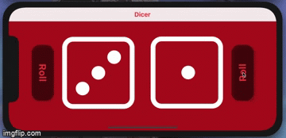

# Dicer
Flutter Mobile Application for Android/IOS

Ever wanted to play some dice-related game but you just could NOT find the dice?
Well, no more looking for the dice that you last saw a month ago, Dicer is here to solve that problem for you! 
Happy game night!

# Concepts Used:
- OOP
- Animations
- Widgets Seperation
- Widgets reutilization
- Portrait and Landscape modes support
- Using Andoird/iOS Platform-Specific Widgets 

# Packages/Tools used:
- Provider
- SVG images
- Icon Creation for Android/IOS
- Splash Screen creation for Android/iOS
