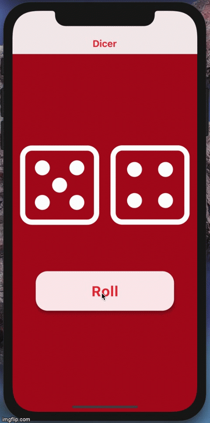

# Dicer
Flutter Mobile Application for Android/IOS

Ever wanted to play some dice-related game but you just could NOT find the dice?
Well, no more looking for the dice that you last saw a month ago, Dicer is here to solve that problem for you! 
Happy game night!

# Concepts Used:
- OOP
- Animations [Open Container Transform especially]
- Widgets Modularization
- Widgets Repurposing
- Canvas and  Custom Painter
- Gesture Detector
- State Management [GetX]
- Local Storage [Shared Prefrences / Get Storage]
- Resizing Widgets on the fly
- Grouping and Managing Options [Speed Dial Package]

# Packages/Tools used:
- GetX, https://pub.dev/packages/get
- SVG images ,   https://pub.dev/packages/flutter_svg
- Animations,    https://pub.dev/packages/animations
- Speed Dial,    https://pub.dev/packages/flutter_speed_dial
- Color picker,  https://pub.dev/packages/flutter_colorpicker
- Icon Creation for Android/IOS
- Splash Screen creation for Android/iOS
